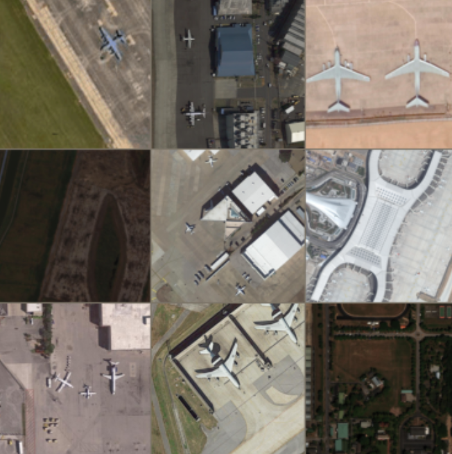
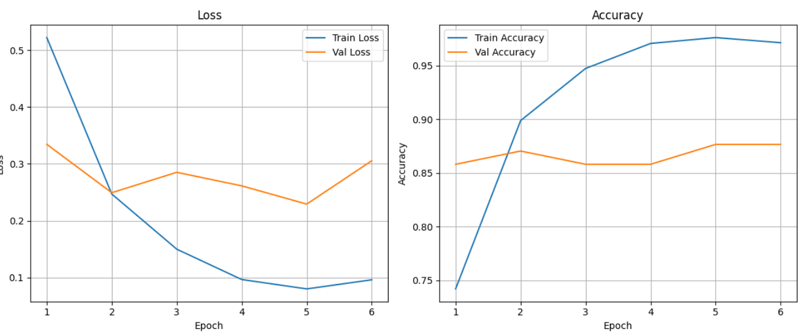
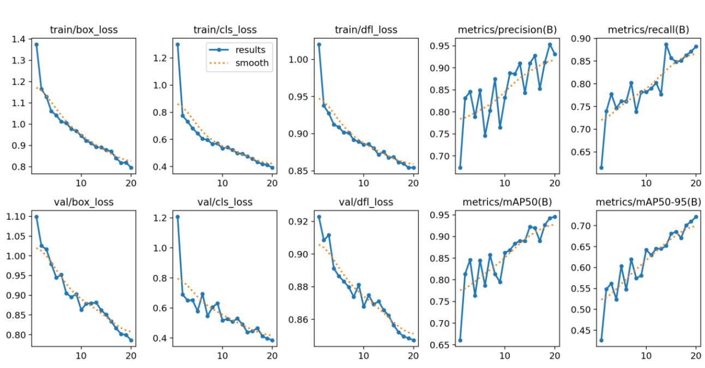
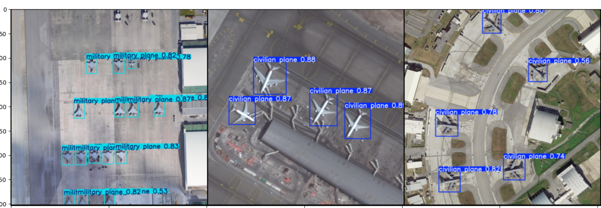

# Підсистема інтелектуального аналізу образів і розпізнавання об'єктів на земній поверхні

## 1. Тема

Метою дипломної роботи є розробка підсистеми для інтелектуального аналізу супутникових та аерофотознімків з аеродромів. Система виконує дві основні задачі:

1. Класифікація зображень на наявність або відсутність літаків на аеродромі.
2. Локалізація виявлених літаків та їх розподіл на **військові** та **цивільні**.

Для першого етапу використовувався згортковий класифікатор **ResNet34**, а для другого — детектор **YOLOv8s** з бібліотеки Ultraytics. Обидві мережі були донавчені (fine-tuned) із використанням фреймворку **PyTorch**.

---

## 2. Опис даних

Для навчання та тестування моделі використовувався набір зображень аеродромів різних типів (громадські, військові) з анотованими мітками:

* **Клас**: наявність / відсутність літака на кадрі
* **Об'єкти**: локалізація літаків та їх розподіл на військові/цивільні



---

## 3. Класифікація зображень: ResNet34

### Архітектура

ResNet34 — глибока згорткова мережа з 34 шарами, що використовує залишкові зв’язки для запобігання проблемі зникнення градієнта. Для нашої задачі:

* Початковий шар обробки зображень розміром 224×224
* Чотири блоки залишкових модулів
* Фінальний fully-connected шар з 2 нейронами (класи:

  * "Літак присутній"
  * "Літак відсутній")

Мережу було донавчено на власному наборі даних з початкової вагової ініціалізацією ImageNet.

### Метрики якості



---

## 4. Локалізація і класифікація: YOLOv8s

### Архітектура

YOLOv8s — сучасний варіант детекторів "You Only Look Once" з високою швидкістю та точністю:

* Backbone: CSPDarknet
* Neck: PANet для масштабного об’єднання ознак
* Head: прогноз координат рамок та класів об’єктів (військовий/цивільний)

Мережу було донавчено із початковими вагами ultralytics на власному наборі анотованих знімків.

### Метрики якості



---

## 5. Результати тестування

В цьому розділі подано приклади результатів детекції та класифікації літаків на тестових зображеннях.



## 6. Встановлення та запуск

### Вимоги до середовища

Для коректної роботи підсистеми необхідно мати встановлені наступні компоненти:

- **Операційна система**: Windows 10 / Ubuntu 20.04 або новіше  
- **Python**: версія 3.9 або новіше  
- **CUDA** (опційно): версія 11.8 для використання GPU  
- **Бібліотеки Python**:
  - `torch`
  - `torchvision`
  - `ultralytics`
  - `numpy`
  - `matplotlib`
  - `Pillow`
  - `python-dotenv`

> ⚠️ Усі бібліотеки можна встановити за допомогою файлу залежностей:

```bash
pip install -r requirements.txt
```

Або вручну:

```bash
pip install torch torchvision ultralytics numpy matplotlib pillow python-dotenv
```

---

### Підготовка середовища

1. **Клонування репозиторію**:

```bash
git clone <repo_url>
cd <repo_folder>
```

2. **Створення файлу `.env`** у корені проєкту з наступним вмістом:

```
RESNET34_WEIGHTS_PATH=path/to/resnet_weights.pth
YOLO_WEIGHTS_PATH=path/to/yolo_weights.pt
```

3. **Підготовка вагових файлів**:
   - Завантажити донавчену модель **ResNet34** у форматі `.pth`
   - Завантажити модель **YOLOv8s** у форматі `.pt` (з Ultralytics або власна)
   - Вказати відповідні шляхи до цих файлів у `.env`

---

### Запуск інференсу

Система запускається через консоль. Для виконання інференсу над одним або декількома зображеннями:

```bash
python main.py path/to/image1.jpg path/to/image2.jpg ...
```

Після запуску:

- Виконується класифікація кожного зображення на наявність літака за допомогою **ResNet34**
- Для зображень, де виявлено літак, виконується локалізація та класифікація (військовий/цивільний) за допомогою **YOLOv8s**
- Кожне оброблене зображення з накладеними рамками зберігається як `pred_0.png`, `pred_1.png`, ...
- Виводиться підсумкова сітка зображень за допомогою `matplotlib`